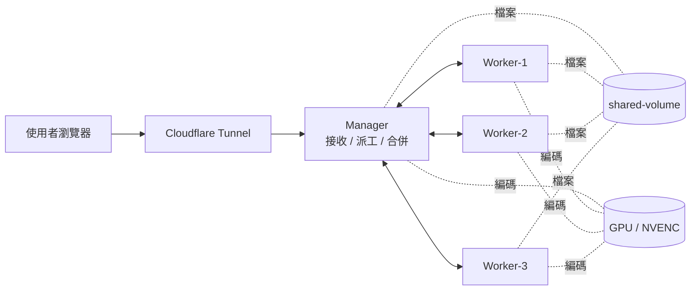
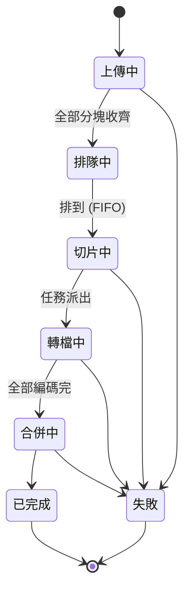
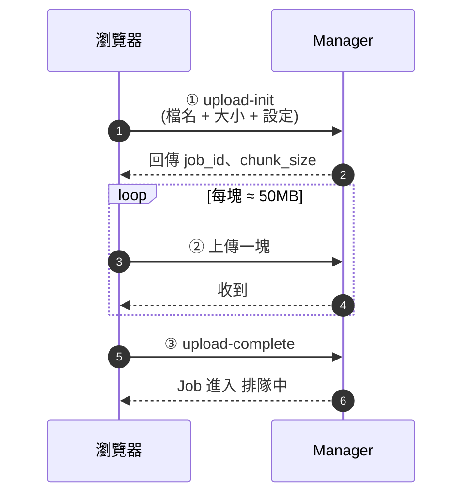
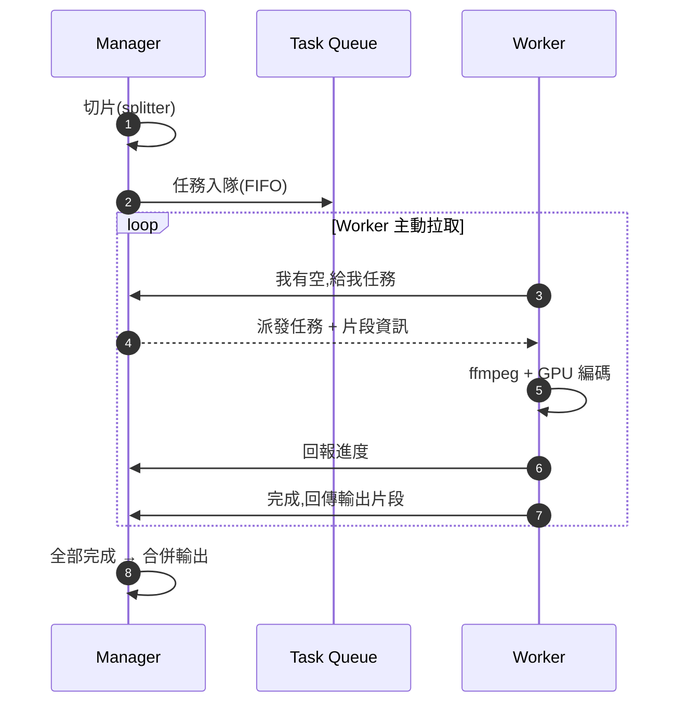
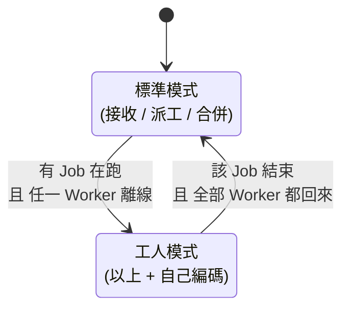

# 分散式影片轉檔系統 — 專案報告

## 一、專案概述

本專案是一套基於 Docker 的分散式影片轉檔系統。將上傳的影片切割為多個片段,由多個 Worker 並行 GPU 加速編碼,最後合併輸出。系統具備 Web 介面、多使用者隔離、Cloudflare Tunnel 對外存取、自動容錯與容量管理。

### 核心特色

| 特色 | 說明 |
|---|---|
| 分散式架構 | 1 Manager + 3 Workers,可水平擴展 |
| GPU 加速 | 使用 NVENC h264,無 GPU 時 fallback 至 libx264 |
| 分塊上傳 | 50 MB chunk,可繞過 Cloudflare 100 MB 限制 |
| 多使用者 | Owner Token 區隔,只能刪自己的 Job |
| Job 排隊 | 嚴格 FIFO,可設定同時處理數 |
| 自動清理 | Job 結束自動刪除上傳檔,容量上限保護 |
| 容錯 | Worker 離線時 Manager 自動下場分擔工作 |
| 即時監控 | 三段式進度條 + 每節點 CPU / Mem / GPU |
| 對外存取 | 整合 Cloudflare Tunnel,給網址即可遠端使用 |

---

## 二、系統架構

詳見 [`docs/architecture.md`](docs/architecture.md)。



### 元件職責

| 元件 | 職責 |
|---|---|
| **Manager** | 接收上傳、規劃切片、派工、追蹤狀態、健康監控、合併輸出 |
| **Worker × 3** | 主動拉取任務、執行 ffmpeg + NVENC、回報進度 |
| **shared-volume** | host bind mount,容器間透過共享磁碟交換片段 |
| **Cloudflare Tunnel** | 在 host 端執行 `cloudflared`,提供 HTTPS 對外網址 |

---

## 三、核心流程

### 3.1 Job 生命週期

詳見 [`docs/job-lifecycle.md`](docs/job-lifecycle.md)。



每個 Job 從建立到結束會經過 6 個主要狀態。只有 **上傳中 / 排隊中** 時 Owner 可以主動刪除;進入轉檔後須等該 Job 結束。

### 3.2 分塊上傳流程

詳見 [`docs/upload-flow.md`](docs/upload-flow.md)。



前端用 `XMLHttpRequest` 切塊上傳,每塊回報進度,過程中即時更新進度條。`upload-init` 階段會檢查容量上限,超過 `MAX_UPLOADS_TOTAL_MB` 直接拒絕。

### 3.3 任務派工流程

詳見 [`docs/task-dispatch.md`](docs/task-dispatch.md)。



採 Pull 模式:Worker 每 2 秒輪詢 Manager,只在自己有空時才拉新任務。失敗任務自動重派最多 3 次。

### 3.4 Manager 模式切換(容錯)

詳見 [`docs/manager-mode.md`](docs/manager-mode.md)。



當 Worker 容器離線(例如 `docker compose stop worker-2`),Manager 偵測到後自動下場跑 ffmpeg,協助當前 Job 完成。當該 Job 結束且全部 Worker 都恢復後才回到標準模式。Manager 編碼以獨立 thread 進行,不影響其他 HTTP 與排程工作。

---

## 四、技術棧

| 層 | 技術 |
|---|---|
| 後端 | Python 3.12 + Flask 3.0 |
| 編碼 | FFmpeg + NVENC(h264_nvenc) / libx264 fallback |
| 容器化 | Docker Compose |
| 前端 | 原生 HTML / CSS / JavaScript(無框架) |
| 遠端存取 | Cloudflare Tunnel(`cloudflared`) |
| 持久化 | JSON 檔(`manager_state.json`)|

### 程式碼結構

```
video_transcoding/
├── manager/
│   ├── app.py              ← Flask 入口,HTTP endpoints
│   ├── scheduler.py        ← Job/Task/Node 狀態管理 + 模式切換
│   ├── splitter.py         ← 影片時間軸切片計畫
│   ├── merger.py           ← 片段合併
│   ├── health_monitor.py   ← Worker 心跳健康檢查
│   ├── manager_worker.py   ← 工人模式下的編碼 loop
│   ├── encoder.py          ← ffmpeg 包裝(與 worker 同份)
│   ├── metrics.py          ← CPU / Mem / GPU 採集
│   └── static/index.html   ← 前端 SPA
├── worker/
│   ├── app.py              ← 任務輪詢 + 執行
│   ├── encoder.py
│   └── metrics.py
├── docs/                   ← 流程圖文件
├── shared-volume/          ← 容器間共享磁碟
├── compose.yaml
└── video_transcoding_menu.bat  ← Windows 一鍵啟動腳本
```

---

## 五、安裝與使用

### 環境需求

- Docker Desktop(Windows / Linux / macOS)
- NVIDIA GPU + NVIDIA Container Toolkit(選用,GPU 編碼用)
- `cloudflared`(選用,對外存取用)

### 啟動

```powershell
# Windows 一鍵啟動
.\video_transcoding_menu.bat
# 選 1:清檔 + 重啟 + 開瀏覽器 + 啟動 TryCloudflare

# 或手動
docker compose up -d --build
```

### 主要環境變數

| 變數 | 預設 | 說明 |
|---|---|---|
| `MAX_CONCURRENT_JOBS` | 1 | 同時可執行的 Job 數 |
| `MAX_UPLOAD_MB` | 2048 | 單一影片大小上限 |
| `MAX_UPLOADS_TOTAL_MB` | 10240 | `uploads/` 目錄總容量上限 |
| `UPLOAD_CHUNK_SIZE_MB` | 50 | 每塊上傳大小 |
| `SEGMENT_DURATION` | 10 | 每片段秒數(會視影片長度自動調整)|
| `MAX_SEGMENTS` | 90 | 單 Job 最大片段數 |
| `TASK_BATCH_SIZE` | 5 | 每任務含幾個片段 |
| `HEARTBEAT_TIMEOUT` | 15 | Worker 心跳逾時秒數 |
| `MAX_TASK_RETRIES` | 3 | 任務失敗重試上限 |

---

## 六、效能討論

### 並行擴展性

單機 3 個 Worker 共享同一張 GPU,實際加速取決於 NVENC 引擎數量:

| 場景 | 預估加速比 |
|---|---|
| 三 Worker × CPU 編碼(libx264) | 接近 ×3 線性擴展 |
| 三 Worker × GPU 編碼(NVENC,消費卡 1-2 engine) | 約 ×1.3 ~ ×1.8 |

### 系統真正價值

本系統的價值不只在單機速度,而在於:

1. **可水平擴展**:Worker 可部署至不同實體機器,程式碼不需更動。
2. **多使用者排隊隔離**:Owner token + Job queue。
3. **容錯**:Worker 離線觸發 Manager 工人模式;任務失敗自動 retry。
4. **可觀測性**:每節點即時 CPU/Mem/GPU、Job 三段式進度條、轉檔耗時統計。
5. **資源保護**:容量上限、自動清理、單檔大小限制、單塊大小限制。

---

## 七、未來展望

- [ ] 真正多機部署測試與 benchmark
- [ ] Job 取消(Cancel running)功能
- [ ] Cloudflare Access SSO 整合取代 owner token
- [ ] WebSocket 推送進度取代輪詢
- [ ] 支援 HLS / DASH 流式輸出
- [ ] 串接 R2 / S3 直傳跳過自家頻寬

---

## 八、文件索引

| 文件 | 內容 |
|---|---|
| [`docs/architecture.md`](docs/architecture.md) | 系統架構圖 |
| [`docs/job-lifecycle.md`](docs/job-lifecycle.md) | Job 生命週期狀態機 |
| [`docs/upload-flow.md`](docs/upload-flow.md) | 分塊上傳時序圖 |
| [`docs/task-dispatch.md`](docs/task-dispatch.md) | 任務派工時序圖 |
| [`docs/manager-mode.md`](docs/manager-mode.md) | Manager 模式切換狀態機 |
