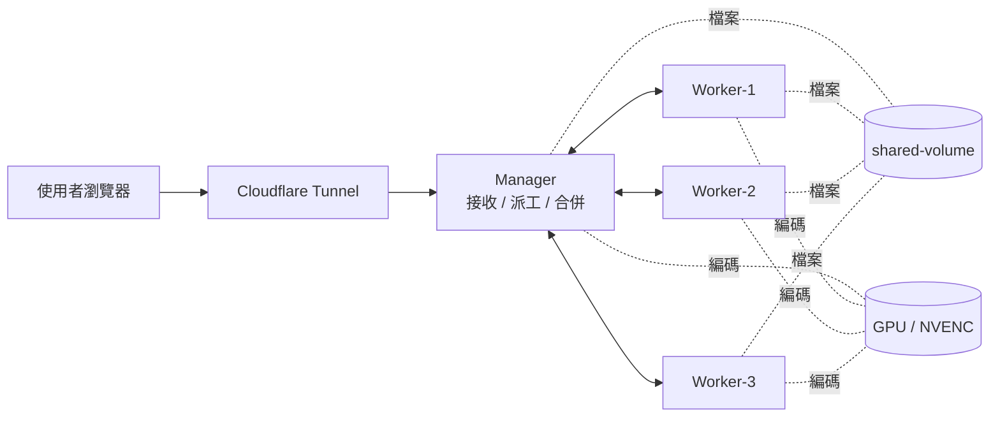

# VideoMaestro

> A distributed, fault-tolerant video transcoding cluster with chunked uploads, GPU acceleration, and a manager-worker failover mode.

VideoMaestro splits an uploaded video into time-based segments, encodes them in parallel across multiple GPU-accelerated worker containers, and merges the result. When a worker dies mid-job, the manager itself steps in as an emergency encoder until the job finishes and all workers recover.

Built to demonstrate practical distributed-systems concepts: leader-coordinated work distribution, pull-based task queues, heartbeat-driven failure detection, multi-tenant isolation, and zero-downtime failover.

---

## Features

- **Distributed encoding** — 1 Manager + 3 Workers (Docker Compose), horizontally scalable
- **GPU acceleration** — NVIDIA NVENC (`h264_nvenc`) with automatic `libx264` fallback
- **Chunked upload** — 50 MB chunks to bypass HTTP body limits (e.g., Cloudflare's 100 MB cap)
- **Multi-user isolation** — Browser-generated owner tokens; users can only delete their own jobs
- **FIFO job queue** — Strict ordering, configurable concurrency (`MAX_CONCURRENT_JOBS`)
- **Storage protection** — Per-file and total `uploads/` caps; automatic cleanup after completion
- **Failover** — Manager auto-enters Worker Mode when any worker is offline and an active job exists; returns to Standard Mode after the job ends and all workers recover
- **Live monitoring** — Per-node CPU / Memory / GPU; three-stage progress bars (upload → transcode → merge); transcoding duration timer
- **Remote access** — Cloudflare Tunnel integration for HTTPS exposure without port forwarding

## Architecture



See [`docs/architecture.md`](docs/architecture.md) for the full breakdown.

## Quick Start

### Requirements
- Docker Desktop (Windows / Linux / macOS)
- *(Optional)* NVIDIA GPU + NVIDIA Container Toolkit for hardware encoding
- *(Optional)* [`cloudflared`](https://developers.cloudflare.com/cloudflare-one/connections/connect-networks/) for remote access

### Run

```bash
docker compose up -d --build
# Open http://localhost:8080
```

**Windows one-click**:

```powershell
.\video_transcoding_menu.bat
# Option 1: clean state + rebuild + open browser + start Cloudflare Tunnel
```

## Documentation

A full project report and topic-focused diagrams:

| Topic | File |
|---|---|
| Project Report | [`PROJECT_REPORT.md`](PROJECT_REPORT.md) |
| System Architecture | [`docs/architecture.md`](docs/architecture.md) |
| Job Lifecycle | [`docs/job-lifecycle.md`](docs/job-lifecycle.md) |
| Chunked Upload Flow | [`docs/upload-flow.md`](docs/upload-flow.md) |
| Task Dispatch | [`docs/task-dispatch.md`](docs/task-dispatch.md) |
| Manager Failover Mode | [`docs/manager-mode.md`](docs/manager-mode.md) |

## Tech Stack

| Layer | Tech |
|---|---|
| Backend | Python 3.12 · Flask 3.0 |
| Encoding | FFmpeg · NVENC (`h264_nvenc`) · `libx264` |
| Containers | Docker Compose |
| Frontend | Vanilla HTML / CSS / JavaScript (no framework) |
| Remote Access | Cloudflare Tunnel |
| Persistence | JSON state file |

## Project Structure

```text
video_transcoding/
├── manager/
│   ├── app.py              # Flask entry, HTTP endpoints
│   ├── scheduler.py        # State machine + concurrency control
│   ├── splitter.py         # Time-based segmentation planning
│   ├── merger.py           # FFmpeg concat demuxer
│   ├── health_monitor.py   # Worker heartbeat watcher
│   ├── manager_worker.py   # Failover encoding loop
│   ├── encoder.py          # FFmpeg wrapper
│   ├── metrics.py          # CPU / Mem / GPU collector
│   └── static/index.html   # Web UI
├── worker/
│   ├── app.py              # Pull-based task loop
│   ├── encoder.py
│   └── metrics.py
├── docs/                   # Mermaid diagrams
├── PROJECT_REPORT.md
├── compose.yaml
└── video_transcoding_menu.bat
```

## Key Environment Variables

| Variable | Default | Description |
|---|---|---|
| `MAX_CONCURRENT_JOBS` | `1` | Active jobs allowed at once |
| `MAX_UPLOAD_MB` | `2048` | Single-file size cap |
| `MAX_UPLOADS_TOTAL_MB` | `10240` | Total `uploads/` directory cap |
| `UPLOAD_CHUNK_SIZE_MB` | `50` | Chunk size for client uploads |
| `SEGMENT_DURATION` | `10` | Seconds per segment |
| `MAX_SEGMENTS` | `90` | Max segments per job |
| `TASK_BATCH_SIZE` | `5` | Segments per task batch |
| `HEARTBEAT_INTERVAL` | `5` | Worker heartbeat interval (sec) |
| `HEARTBEAT_TIMEOUT` | `15` | Manager timeout threshold (sec) |
| `HEARTBEAT_FAILURE_THRESHOLD` | `3` | Consecutive misses → offline |
| `TASK_TIMEOUT_SECONDS` | `3600` | Task execution timeout |
| `MAX_TASK_RETRIES` | `3` | Per-task retry limit |
| `VIDEO_ENCODER` | `auto` | `auto` prefers NVENC, falls back to `libx264` |

## API Summary

| Method | Endpoint | Purpose |
|---|---|---|
| `POST` | `/jobs/upload-init` | Begin chunked upload (returns `job_id`, `chunk_size`) |
| `POST` | `/jobs/{id}/chunks/{i}` | Upload chunk `i` (sequential) |
| `POST` | `/jobs/{id}/upload-complete` | Finalize upload, enqueue |
| `GET` | `/jobs` | List all jobs |
| `GET` | `/jobs/{id}` | Job detail + task progress |
| `DELETE` | `/jobs/{id}` | Delete own queued job (requires `X-Owner-Id`) |
| `GET` | `/jobs/{id}/download` | Download final output |
| `GET` | `/nodes` | Worker status + CPU/Mem/GPU |
| `GET` | `/manager/info` | Manager status + mode (Standard/Worker) |
| `POST` | `/nodes/register` | Worker registration (internal) |
| `POST` | `/nodes/{name}/heartbeat` | Worker heartbeat + metrics (internal) |
| `GET` | `/workers/{name}/task` | Worker task pull (internal) |
| `POST` | `/workers/{name}/task/{id}/progress` | Worker progress report (internal) |
| `POST` | `/workers/{name}/task/{id}/complete` | Worker completion report (internal) |
| `POST` | `/workers/{name}/task/{id}/fail` | Worker failure report (internal) |

## Design Highlights

- **Logical segmentation, not physical**: the splitter only computes `(start_time, duration)` tuples; workers seek into the shared source file with `ffmpeg -ss -t`. No source-file copies are written.
- **Pull-based dispatch**: workers poll the manager every 2s. The manager never tracks worker availability — workers self-select when idle.
- **Three failure modes, three policies**: explicit worker failure increments retry count; worker offline does not (it's not the task's fault); task timeout increments retry count.
- **Concat without re-encoding**: all segments share identical encoding parameters, so the final merge uses FFmpeg's `concat` demuxer with `-c copy` — a few seconds, no GPU.
- **State recovery**: on manager restart, in-flight tasks are requeued, half-uploaded jobs are failed, and the JSON state file restores the world.

## License

MIT
