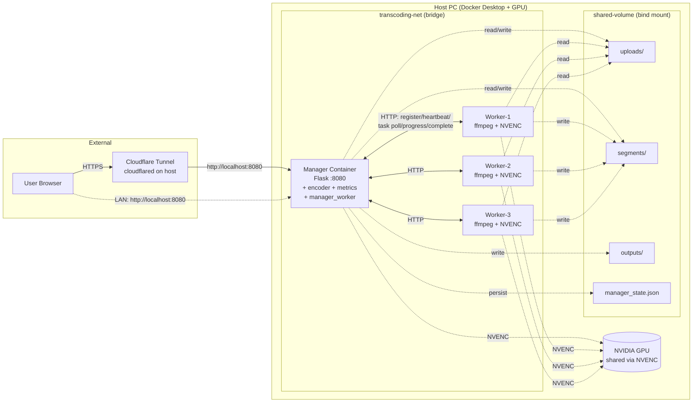

# Architecture

```mermaid
graph LR
    subgraph external["External"]
        BROWSER[User Browser]
        CF[Cloudflare Tunnel<br/>cloudflared on host]
    end

    subgraph host["Host PC (Docker Desktop + GPU)"]
        subgraph net["transcoding-net (bridge)"]
            MGR["Manager Container<br/>Flask :8080<br/>+ encoder + metrics<br/>+ manager_worker"]
            W1["Worker-1<br/>ffmpeg + NVENC"]
            W2["Worker-2<br/>ffmpeg + NVENC"]
            W3["Worker-3<br/>ffmpeg + NVENC"]
        end

        subgraph vol["shared-volume (bind mount)"]
            UP[uploads/]
            SEG[segments/]
            OUT[outputs/]
            STATE[manager_state.json]
        end

        GPU[(NVIDIA GPU<br/>shared via NVENC)]
    end

    BROWSER -->|HTTPS| CF
    CF -->|http://localhost:8080| MGR
    BROWSER -.->|LAN: http://localhost:8080| MGR

    MGR <-->|HTTP: register/heartbeat/<br/>task poll/progress/complete| W1
    MGR <-->|HTTP| W2
    MGR <-->|HTTP| W3

    MGR -.read/write.-> UP
    MGR -.read/write.-> SEG
    MGR -.write.-> OUT
    MGR -.persist.-> STATE
    W1 -.read.-> UP
    W1 -.write.-> SEG
    W2 -.read.-> UP
    W2 -.write.-> SEG
    W3 -.read.-> UP
    W3 -.write.-> SEG

    MGR -. NVENC .-> GPU
    W1 -. NVENC .-> GPU
    W2 -. NVENC .-> GPU
    W3 -. NVENC .-> GPU
```