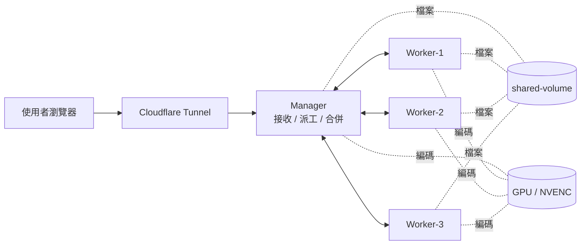

# 系統架構

```mermaid
graph LR
    USER[使用者瀏覽器]
    CF[Cloudflare Tunnel]
    MGR[Manager<br/>接收 / 派工 / 合併]
    W1[Worker-1]
    W2[Worker-2]
    W3[Worker-3]
    VOL[(shared-volume)]
    GPU[(GPU / NVENC)]

    USER --> CF --> MGR
    MGR <--> W1
    MGR <--> W2
    MGR <--> W3
    MGR -.檔案.- VOL
    W1 -.檔案.- VOL
    W2 -.檔案.- VOL
    W3 -.檔案.- VOL
    MGR -.編碼.- GPU
    W1 -.編碼.- GPU
    W2 -.編碼.- GPU
    W3 -.編碼.- GPU
```

## 重點

- **Manager**:對外接收上傳、對內派工與合併。
- **Worker × 3**:主動向 Manager 拉任務,執行 GPU 編碼。
- **shared-volume**:容器間透過共享磁碟交換影片片段。
- **Cloudflare Tunnel**:提供對外的 HTTPS 網址,不必開放路由器埠。
