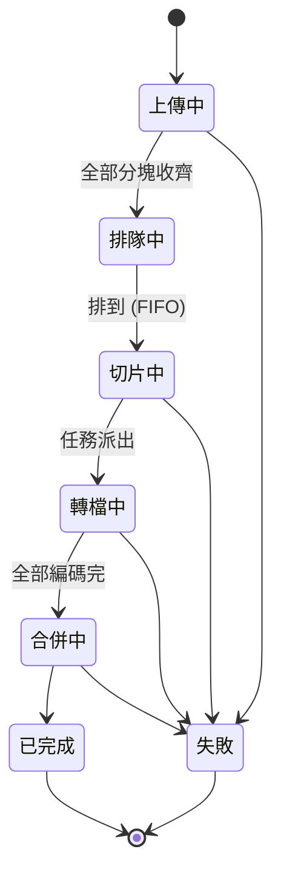

# Job 生命週期

```mermaid
stateDiagram-v2
    [*] --> 上傳中
    上傳中 --> 排隊中: 全部分塊收齊
    排隊中 --> 切片中: 排到 (FIFO)
    切片中 --> 轉檔中: 任務派出
    轉檔中 --> 合併中: 全部編碼完
    合併中 --> 已完成
    已完成 --> [*]

    上傳中 --> 失敗
    切片中 --> 失敗
    轉檔中 --> 失敗
    合併中 --> 失敗
    失敗 --> [*]
```

## 重點

- **上傳中 / 排隊中** 可由 Owner 刪除,進入後續狀態後不可刪。
- 同一時間只有一個 Job 處於 切片中 / 轉檔中 / 合併中(由 `MAX_CONCURRENT_JOBS` 控制,預設 1)。
- 進入 已完成 / 失敗 後,原始上傳檔會自動清除。
