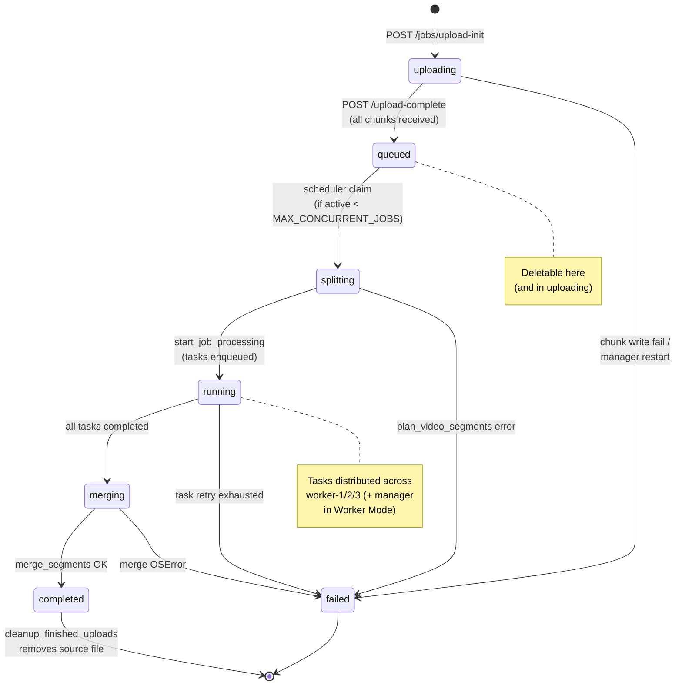

# Job-Lifecycle

```mermaid
stateDiagram-v2
    [*] --> uploading: POST /jobs/upload-init
    uploading --> queued: POST /upload-complete<br/>(all chunks received)
    uploading --> failed: chunk write fail /<br/>manager restart
    queued --> splitting: scheduler claim<br/>(if active < MAX_CONCURRENT_JOBS)
    splitting --> running: start_job_processing<br/>(tasks enqueued)
    splitting --> failed: plan_video_segments error
    running --> merging: all tasks completed
    running --> failed: task retry exhausted
    merging --> completed: merge_segments OK
    merging --> failed: merge OSError
    completed --> [*]: cleanup_finished_uploads<br/>removes source file
    failed --> [*]

    note right of queued
        Deletable here
        (and in uploading)
    end note
    note right of running
        Tasks distributed across
        worker-1/2/3 (+ manager
        in Worker Mode)
    end note
```