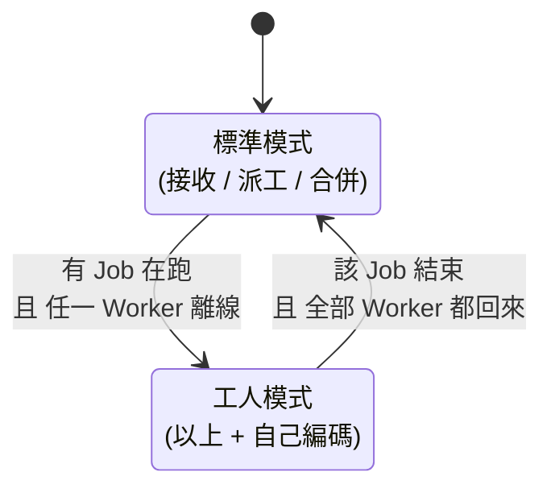

# Manager 模式切換

```mermaid
stateDiagram-v2
    [*] --> 標準模式

    標準模式: 標準模式<br/>(接收 / 派工 / 合併)
    工人模式: 工人模式<br/>(以上 + 自己編碼)

    標準模式 --> 工人模式: 有 Job 在跑<br/>且 任一 Worker 離線
    工人模式 --> 標準模式: 該 Job 結束<br/>且 全部 Worker 都回來
```

## 重點

- **觸發**:有 Worker 離線且當前有 Job 在執行 → Manager 自動下場一起編碼。
- **復原**:必須同時滿足「Job 結束」與「全部 Worker 恢復在線」,Manager 才回到標準模式。
- **不中斷**:模式切換不會打斷正在進行中的 ffmpeg,只決定要不要拉新任務。
