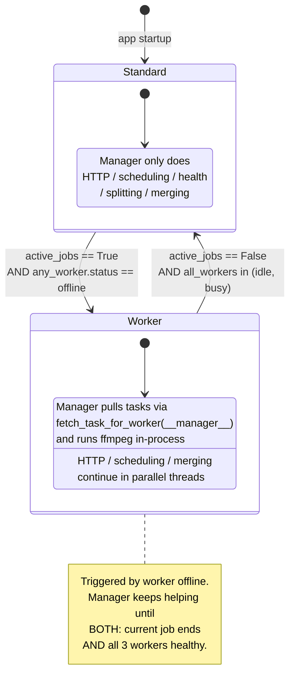

# Manager-Mode

```mermaid
stateDiagram-v2
    [*] --> Standard: app startup

    Standard --> Worker: active_jobs == True<br/>AND any_worker.status == offline
    Worker --> Standard: active_jobs == False<br/>AND all_workers in (idle, busy)

    state Standard {
        [*] --> Idle_Std
        Idle_Std: Manager only does<br/>HTTP / scheduling / health<br/>/ splitting / merging
    }

    state Worker {
        [*] --> Encoding
        Encoding: Manager pulls tasks via<br/>fetch_task_for_worker(__manager__)<br/>and runs ffmpeg in-process
        Encoding: HTTP / scheduling / merging<br/>continue in parallel threads
    }

    note right of Worker
        Triggered by worker offline.
        Manager keeps helping until
        BOTH: current job ends
        AND all 3 workers healthy.
    end note
```