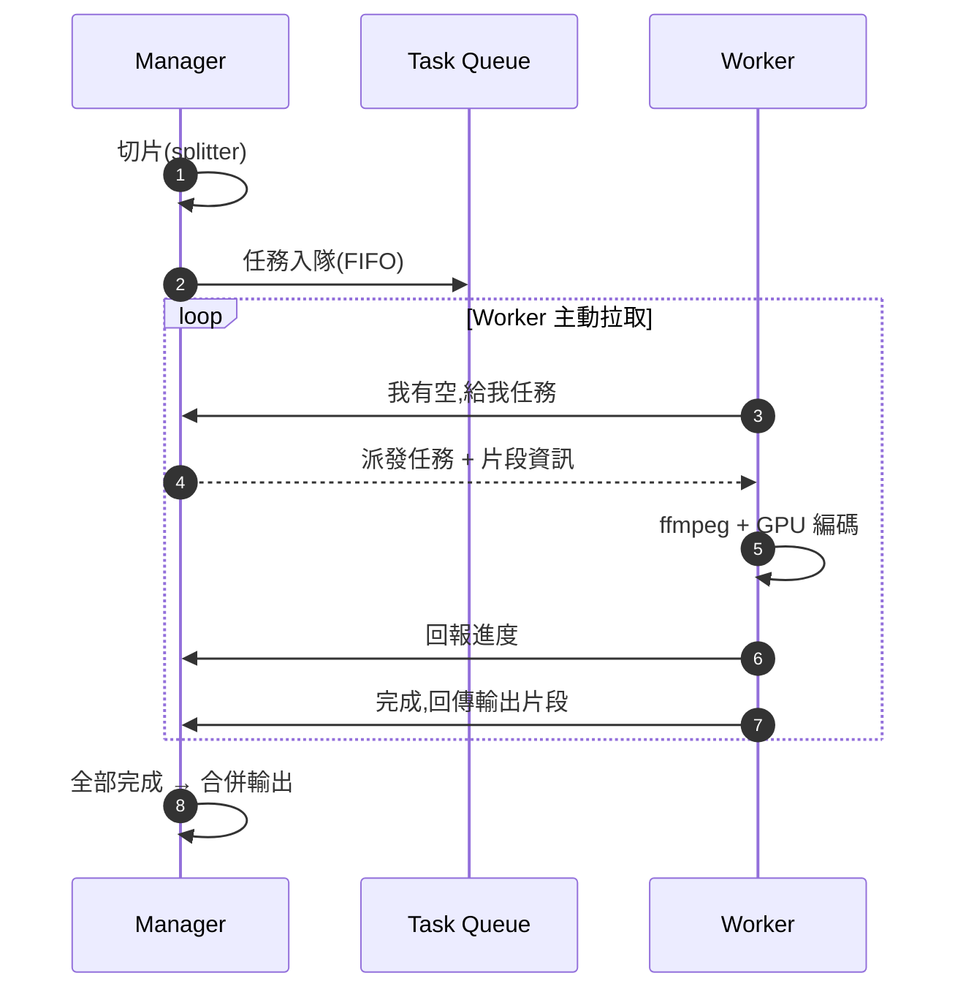

# 任務派工流程

```mermaid
sequenceDiagram
    autonumber
    participant Manager
    participant Queue as Task Queue
    participant Worker

    Manager->>Manager: 切片(splitter)
    Manager->>Queue: 任務入隊(FIFO)

    loop Worker 主動拉取
        Worker->>Manager: 我有空,給我任務
        Manager-->>Worker: 派發任務 + 片段資訊
        Worker->>Worker: ffmpeg + GPU 編碼
        Worker->>Manager: 回報進度
        Worker->>Manager: 完成,回傳輸出片段
    end

    Manager->>Manager: 全部完成 → 合併輸出
```

## 重點

- **Pull 模式**:Worker 主動拉取任務,Manager 不必追蹤誰有空。
- **FIFO 派發**:任務嚴格依進入隊列順序給出。
- **自動 retry**:Worker 失敗或心跳逾時,任務會被重派(最多 3 次)。
