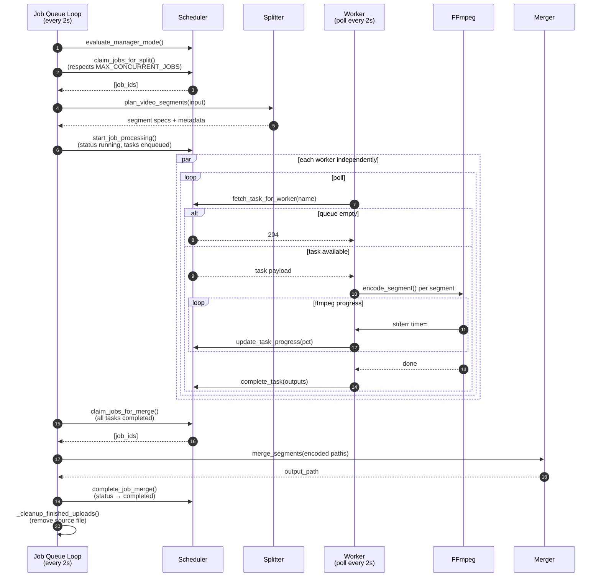

# Task-Dispatch

```mermaid
sequenceDiagram
    autonumber
    participant Q as Job Queue Loop<br/>(every 2s)
    participant S as Scheduler
    participant SP as Splitter
    participant W as Worker<br/>(poll every 2s)
    participant E as FFmpeg
    participant MG as Merger

    Q->>S: evaluate_manager_mode()
    Q->>S: claim_jobs_for_split()<br/>(respects MAX_CONCURRENT_JOBS)
    S-->>Q: [job_ids]
    Q->>SP: plan_video_segments(input)
    SP-->>Q: segment specs + metadata
    Q->>S: start_job_processing()<br/>(status running, tasks enqueued)

    par each worker independently
        loop poll
            W->>S: fetch_task_for_worker(name)
            alt queue empty
                S-->>W: 204
            else task available
                S-->>W: task payload
                W->>E: encode_segment() per segment
                loop ffmpeg progress
                    E->>W: stderr time=
                    W->>S: update_task_progress(pct)
                end
                E-->>W: done
                W->>S: complete_task(outputs)
            end
        end
    end

    Q->>S: claim_jobs_for_merge()<br/>(all tasks completed)
    S-->>Q: [job_ids]
    Q->>MG: merge_segments(encoded paths)
    MG-->>Q: output_path
    Q->>S: complete_job_merge()<br/>(status → completed)
    Q->>Q: _cleanup_finished_uploads()<br/>(remove source file)
```