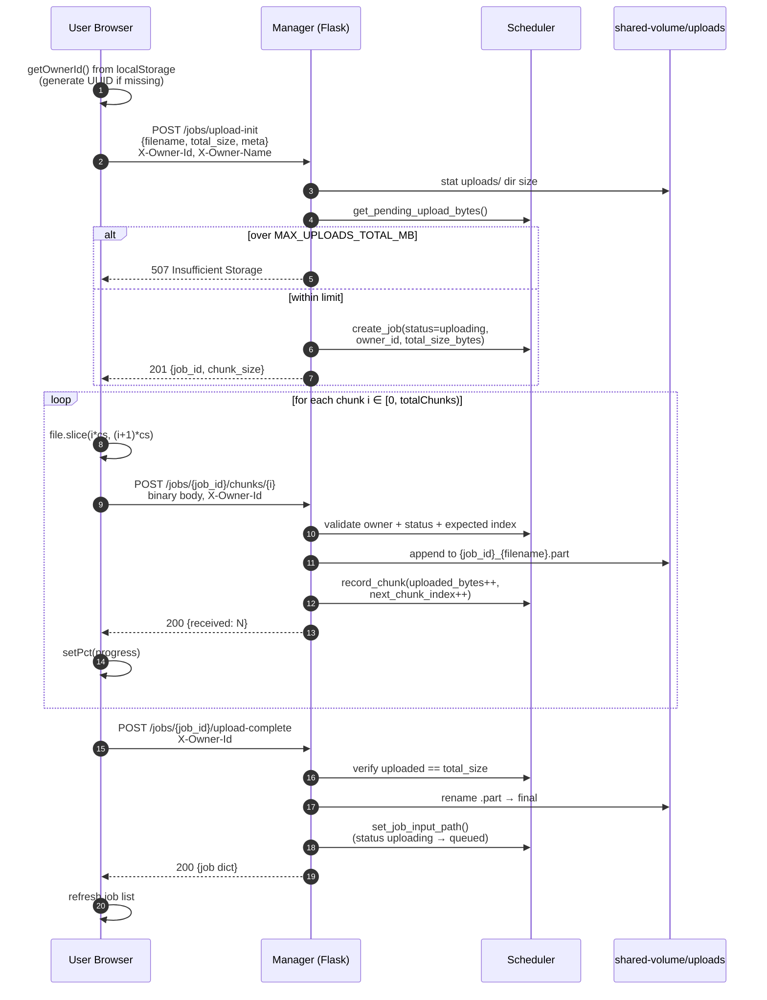

# Upload-Flow

```mermaid
sequenceDiagram
    autonumber
    participant U as User Browser
    participant M as Manager (Flask)
    participant S as Scheduler
    participant FS as shared-volume/uploads

    U->>U: getOwnerId() from localStorage<br/>(generate UUID if missing)
    U->>M: POST /jobs/upload-init<br/>{filename, total_size, meta}<br/>X-Owner-Id, X-Owner-Name
    M->>FS: stat uploads/ dir size
    M->>S: get_pending_upload_bytes()
    alt over MAX_UPLOADS_TOTAL_MB
        M-->>U: 507 Insufficient Storage
    else within limit
        M->>S: create_job(status=uploading,<br/>owner_id, total_size_bytes)
        M-->>U: 201 {job_id, chunk_size}
    end

    loop for each chunk i ∈ [0, totalChunks)
        U->>U: file.slice(i*cs, (i+1)*cs)
        U->>M: POST /jobs/{job_id}/chunks/{i}<br/>binary body, X-Owner-Id
        M->>S: validate owner + status + expected index
        M->>FS: append to {job_id}_{filename}.part
        M->>S: record_chunk(uploaded_bytes++,<br/>next_chunk_index++)
        M-->>U: 200 {received: N}
        U->>U: setPct(progress)
    end

    U->>M: POST /jobs/{job_id}/upload-complete<br/>X-Owner-Id
    M->>S: verify uploaded == total_size
    M->>FS: rename .part → final
    M->>S: set_job_input_path()<br/>(status uploading → queued)
    M-->>U: 200 {job dict}
    U->>U: refresh job list
```