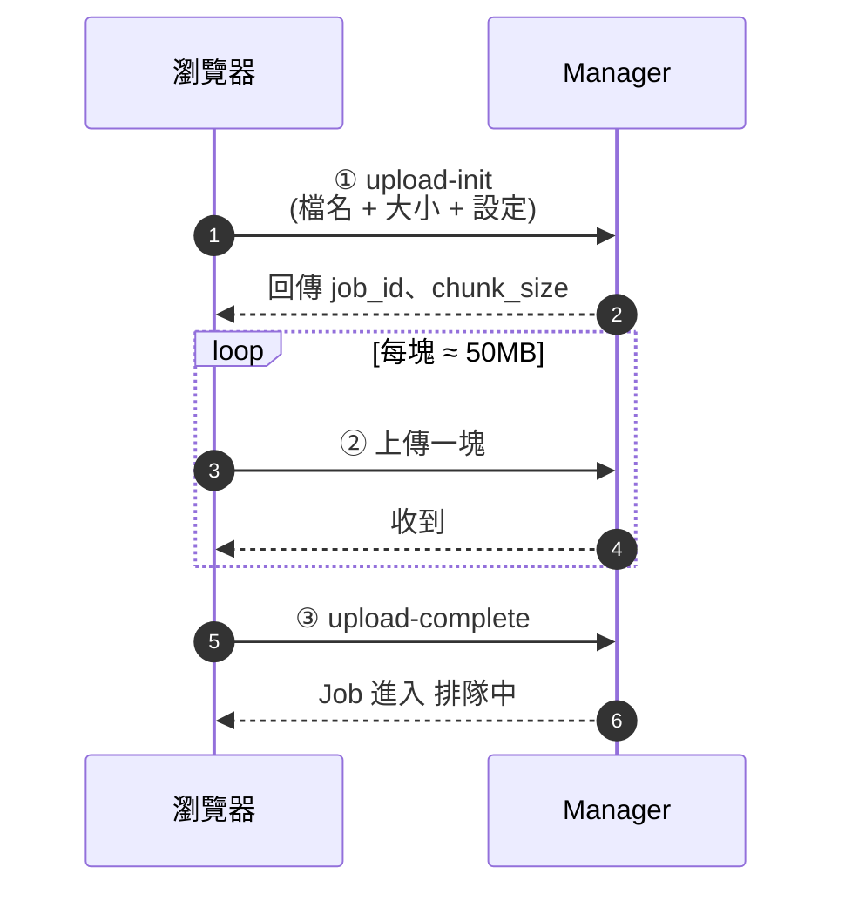

# 分塊上傳流程

## 重點

- **為什麼分塊**:Cloudflare Tunnel 對 HTTP body 上限為 100MB,分塊上傳可繞過此限制,並讓單檔最大可達 2GB(可調)。
- **斷點安全**:Manager 嚴格按 index 接收,缺塊不會被接受。
- **容量保護**:`upload-init` 前會檢查 `uploads/` 剩餘空間,超過 `MAX_UPLOADS_TOTAL_MB` 直接拒絕。
